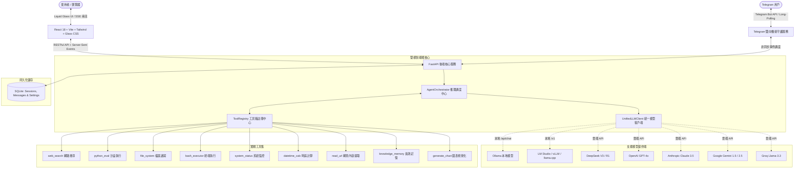

# 💧 AetherAI Studio 2.0 (AetherAgent)

> **極致美感 Liquid Glass（流光水感毛玻璃 / Apple VisionOS 風格）本地與雲端雙模自主 AI Agent 系統。**  
> 本專案為 [AetherAI-Studio](https://github.com/hankyleisplay/AetherAI-Studio.git) 的全面升級版 2.0，深度融合社群橋接器（Telegram Bot）、科學級 LaTeX 數學排版、雙向語音互動、Windows PowerShell 一鍵啟動與全自動跨平台部署。

---

## ✨ 核心特色亮點

### 1. 🌊 Liquid Glass 水感極致美學 (Liquid Glass Aesthetics)
* **動態流體光球反應（Adaptive Ambient Fluid）**：背景光暈球依據 Agent 當前運作狀態即時變幻色彩與脈動律動：
  - 🌌 **閒置待命（Idle）**：深邃星空藍與青藍微光流轉。
  - 🔮 **深度思考（Thinking）**：紫羅蘭與洋紅波紋脈衝，展開即時思維鏈（Reasoning Chain）。
  - 🌿 **執行工具（Calling Tool）**：翡翠綠與琉璃金流光迴旋，清晰呈現調用參數與毫秒級執行結果。
  - ⚡ **串流生成（Streaming）**：高科技電光青與藍調流體漣漪。
* **高階光學毛玻璃（Optical Glassmorphism）**：`backdrop-blur-2xl` 高斯模糊、折射鏡面反光邊框（Specular Highlights）與半透明浮雕陰影。

### 2. ✈️ Telegram 雙向智能體橋接 (Telegram Bot Bridge)
* **背景非同步長輪詢守護行程**：基於 Python `asyncio` + `httpx`，無需公網 Webhook，內網或本機環境即可直連 Telegram。
* **無縫銜接 Agent 核心**：在 Telegram 中傳送文字，Agent 會自動發送 `typing` 打字狀態，自主思考並調用 9 大工具執行任務後回傳。
* **內建 Telegram 控制指令**：
  - `/status`：查看系統負載、當前使用的 LLM 模型與連線狀態。
  - `/tools`：列出已啟用的 9 大 Agent 工具。
  - `/new`：清空記憶並開啟全新對話 Session。
  - `/help`：顯示說明選單。
* **安全存取控制**：支援鎖定特定 `Chat ID`，嚴格防止未授權存取。對話紀錄自動歸檔至 SQLite 資料庫。

### 3. 📐 科學級 LaTeX 數學公式排版 (LaTeX Math Typesetting)
* **輕量無依賴公式引擎**：融合 AetherAI 1.0 的數學符號解析系統，自動識別並美化公式。
* **支援行內與獨立公式**：
  - 行內公式：`$e^{i\pi} + 1 = 0$`、`$x = \frac{-b \pm \sqrt{b^2-4ac}}{2a}$`
  - 區塊公式：`$$\int_{0}^{\infty} e^{-x^2} dx = \frac{\sqrt{\pi}}{2}$$`
* **Liquid Glass 科技發光質感**：公式文字具備青藍微光暈與半透明毛玻璃底板。

### 4. 🧠 雙模推理引擎（Dual-Mode Reasoning Engine）
* **原生 Function Calling**：完美對接 GPT-4o、Claude 3.5 Sonnet、Gemini 2.5 Flash、DeepSeek-V3 等雲端高階模型的標準 JSON Tool Calling 協議。
* **智慧 ReAct 文字推理後備機制（Smart ReAct Fallback）**：針對 7B/8B 本地量化模型（如 Llama 3、Mistral、Qwen 等）不擅長輸出 JSON Schema 的情況，內建文字 ReAct 解析器（`Thought -> Action -> Action Input -> Observation`），讓小參數本地模型也能順暢調用工具！

### 5. 🔌 開箱即用的 9 大強大工具箱（Pluggable Tools）
* 🔍 **即時網路檢索 (`web_search`)**：免 API Key，直接透過 DuckDuckGo 即時搜尋全網資訊並擷取摘要。
* 🌐 **特定網頁提取器 (`read_url`)**：給定任意 URL，自動解析去除雜訊與廣告，提煉乾淨可讀正文內容。
* 🧠 **跨會話長效記憶庫 (`knowledge_memory`)**：持久化儲存特定背景、偏好與知識要點，打破會話隔閡。
* 📊 **視覺化圖表生成器 (`generate_chart`)**：生成長條圖、折線圖與比例圖數據，UI 即時繪製玻璃感動態圖表。
* 🐍 **Python 沙盒計算機 (`python_eval`)**：即時編譯執行 Python 腳本、數學計算與演算法驗證。
* 📂 **工作區檔案系統 (`file_system`)**：受沙盒防護（Path Traversal Safe）的安全本地檔案讀取、寫入、檔案清單檢視與管理。
* 🖥️ **命令列終端執行器 (`bash_executor`)**：受控執行的 Shell 指令環境（具備危險指令攔截與逾時保護）。
* 📊 **主機系統狀態診斷 (`system_status`)**：即時讀取 CPU 核心負載、記憶體剩餘、磁碟可用容量與作業系統資訊。
* ⏰ **日期時間與時區運算 (`datetime_calc`)**：精確的時間日期運算與多時區解析。

### 6. 📝 企業級全功能 Markdown 系統 (Powerful Markdown Engine)
* 📊 **Mermaid 視覺化向量圖表**：支援流程圖（`flowchart TD/LR`）與時序序列圖（`sequenceDiagram`），具備圖表/原始碼雙模式切換、縮放與 SVG 向量圖匯出。
* 💻 **高級代碼語法高亮**：支援 Python, TS, JS, Bash, SQL, Rust, Go 等多語言詞法著色，獨立行號槽、超過 20 行智慧折疊與一鍵下載代碼檔案。
* 🚨 **GitHub 風格五大警示塊**：原生支援 `> [!NOTE]`、`> [!TIP]`、`> [!IMPORTANT]`、`> [!WARNING]` 與 `> [!CAUTION]` 毛玻璃光澤卡片。
* 📋 **Liquid Glass GFM 表格**：支援欄位左/中/右對齊、斑馬紋交替背景與自適應水平滾動。
* 🧮 **科學級 LaTeX 數學排版**：真分數、根式、矩陣、希臘字母、微積分與物理符號無失真渲染。
* ☑️ **任務待辦核取方塊**：支援 `- [x]` 與 `- [ ]` 清單排版。

### 7. 🌐 全方位多國語言國際化 (Multi-Language i18n)
* 支援 4 大主要語系：🇹🇼 **繁體中文 (`zh-TW`)**、🇨🇳 **简体中文 (`zh-CN`)**、🇺🇸 **English (`en`)**、🇯🇵 **日本語 (`ja`)**。
* 頂部 Liquid Glass 快捷語系切換膠囊，瀏覽器自動持久化偏好設定。
* 語系切換即時連動 Web Speech API 語音輸入辨識與 TTS 朗讀發音引擎。

### 8. 🎙️ 雙向語音與多模態互動
* 🎤 **語音聽寫輸入（Voice Dictation）**：採用 Web Speech API 即時語音轉文字，按下麥克風即可聲控 Agent。
* 🔊 **語音朗讀合成（Text-to-Speech）**：單鍵將 Agent 的回覆轉換為自然中文/英文語音朗讀。
* 📎 **工作區檔案拖曳上傳**：支援將文件、代碼、數據表格拖入對話框，自動上傳至工作區供 Agent 調閱。
* 💾 **對話一鍵匯出**：單鍵將當前對話歷史匯出為標準 Markdown (`.md`) 筆記，或單則回答一鍵下載。
* 🎭 **專屬工程代理陣列（Personas）**：預載 4 大企業級工程角色（核心主控、系統架構、情報研析、SRE 專家），並可自訂 System Prompt 與授權工具鏈。

---

## 🏗️ 系統架構



---

## 🚀 快速開始

### 方式 A：Windows 使用者（PowerShell 一鍵啟動）

在專案目錄下開啟 PowerShell 執行：

```powershell
# 啟動伺服器並自動開啟瀏覽器
.\run.ps1
```

首次安裝可執行：
```powershell
.\install.ps1
```

選項參數：
```powershell
.\run.ps1 -Port 8888      # 自訂連接埠
.\run.ps1 -Dev            # 同時啟動 FastAPI 與 Vite 前端熱重載
.\run.ps1 -Check          # 執行環境與 9 大工具自我診斷
```

---

### 方式 B：Linux / macOS 使用者

執行一鍵啟動腳本：

```bash
chmod +x run.sh
./run.sh
```

或使用全能啟動器：
```bash
python3 start.py
```

自檢診斷：
```bash
python3 start.py --check
```

---

## ⚙️ 模型與 Telegram 設定

啟動後於瀏覽器造訪 `http://localhost:8000`，點擊右上角 **⚙️ 設定圖示**：

### 1. 模型端點設定
* **本地模型**：選擇「Ollama」或「LM Studio」，免填 API Key，點擊「測試連線並拉取模型」可自動探測已下載的模型清單。
* **雲端模型**：支援切換至 OpenAI、Anthropic Claude、Google Gemini、DeepSeek 或 Groq，貼上 API Key 即刻生效。

### 2. Telegram Bot 橋接設定
1. 向 [@BotFather](https://t.me/BotFather) 發送 `/newbot` 取得 Bot Token。
2. 在設定中心貼上 Token。
3. （可選）向 [@userinfobot](https://t.me/userinfobot) 取得您的 Chat ID 並填入以啟用安全存取白名單。
4. 打開「啟用 Telegram 智能代理橋接」開關並點擊儲存，服務即在背景自動運作！

---

## 🧪 自我診斷與測試

本專案提供端到端自動化整合測試套件：

```bash
python3 test_backend.py
```

測試涵蓋：
* 系統健康狀態與 SQLite 資料庫連線
* 模型設定保存與動態探測
* 9 大內建工具執行能力
* 對話 Session 建立與 Markdown 匯出
* Telegram 橋接器狀態與配置端點
* Liquid Glass 前端 SPA 靜態託管

---

## 📄 開源授權

本專案採用 [MIT License](LICENSE) 授權。由 Hankyle 打造，歡迎 Star 與共同貢獻！
